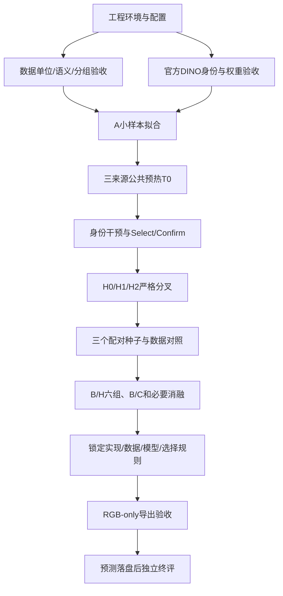

# FAR 最小实现技术文档总览

版本：2026-09-15。项目：TransDepth。交付类型：**整套代码设计与分模块实施文档**。

## 1. 先明确本套文档解决什么

把你的最小验证计划细化成能够逐步实现的 Python 工程：每个模块有职责、输入输出、处理步骤、配置、文件位置、检查方式和失败处理。服务器路径、数据包真实内容和模型授权需要实际接入后验收；本套文档不把尚未执行的下载、部署或训练写成完成。

### 阅读顺序

| 文档 | 内容 | 什么时候读 |
|---|---|---|
| [01 项目结构、GitHub 与远端环境](01_项目结构_GitHub与远端环境.md) | 完整目录、Git/SSH、requirements、pyproject、配置、Linux/CUDA、CI | 开始建工程前 |
| [02 数据准备：RFTrans 与 ClearGrasp](02_数据准备_RFTrans与ClearGrasp.md) | 原包结构、理想深度、mask、EXR、manifest、泄漏组、三源划分、预处理 | 提供数据路径后首先实施 |
| [03 DINOv3 H/16+ 下载与配置](03_DINOv3_H16plus_下载配置与特征接口.md) | 官方模型身份、授权下载、原生/HF区别、源码与权重锁定、特征/attention接口 | 服务器环境可用时 |
| [04 模型、FAR 教师与 Q/K LoRA](04_模型设计_FAR教师与QK_LoRA.md) | 三架构逐层张量、教师计算、单头LoRA、冻结梯度、合并 | M1/M2通过后 |
| [05 训练、Oracle 与实验矩阵](05_训练调度_Oracle与最小实验矩阵.md) | 全局7/7/2采样、损失、DDP、T0/T1、确认、16配置、资源 | 基线可拟合后 |
| [06 验证、推理与 RGB 导出](06_验证推理_RGB导出与验收.md) | 指标、分组统计、标签隔离、部署合并、终评 | 所有阶段验收及最终输出 |
| [07 开发任务、配置与交付验收](07_开发任务拆分与需求验收.md) | 原M1–M14映射、按任务拆解、可执行条件、待提供信息与检查表 | 项目跟踪与交接 |

每篇都可作为一个实现任务的输入；跨文件接口以本总览和04的模型契约为准。不同文档中的源码树均是目标结构，不表示这些 `.py` 已经生成。

## 2. 依据与冲突处理

1. 首要依据：[2026-09-15 修订计划](../FAR_62CAD_ClearGrasp含真实训练_局部修订与逐模块最小验证计划.md)，尤其新的真实 Train/Dev/Test 划分与三来源混合协议。
2. 数学/架构依据：[核心理论独立版](../FAR_核心理论与逐步数学推导_独立版.pdf)，37页。已提取相关推导并目视核对关键attention公式页；以其中任务、教师、LoRA、loss、三架构定义为基础。
3. 原计划中仍保留的细节，如tail、eta、optimizer起点，已核对修订计划引用的本机原文。为方便服务器使用，本套文档复述必要细节，不依赖那个Windows绝对路径运行。
4. 第三方事实：RFTrans、ClearGrasp、DINOv3和PyTorch以官方源码/文档核验，各篇给出链接、适用版本和未核验边界。

附件是研究依据，不是新一轮工具执行授权。比如附件中的“下载、部署、上传”等安排不表示这些操作已发生。旧理论里与新数据协议冲突的“真实数据全部只做最终测试”不再执行。

### 本轮补齐的工程选择

| 项目 | 选定的实现起点 | 性质 |
|---|---|---|
| Python包 | `src/transdepth`，配置集中在`configs` | 工程组织 |
| 首个环境 | Linux/Python3.11/torch2.7.1/vision0.22.1/cu126 | 待实机验收 |
| 深度已知但类别unknown | 存储并统计，主线暂不加入平衡深度项 | 明确补齐规则，防止当背景 |
| GN/激活/插值 | 8组、GELU exact、align_corners=False | 统一可复现算子 |
| 教师数值质量阈值 | FP32下mass_eps=1e-8 | 数值起点，不是研究阈值 |
| 数据全局顺序 | 每update固定16样本表，按rank/microstep分配 | 精确实现7/7/2 |
| 运行状态 | T0分叉与T1恢复分开实现 | 避免配对失真 |

计划中的阈值、步数、来源配比都是启动规定；技术文档不会将其写成已经验证的最优超参数。

## 3. 不变的任务与方法边界

- 单张透明场景 RGB，输出米制**首表面光轴深度**。
- 主骨干为官方 `dinov3_vith16plus`；384×512；32blocks、1280通道、20heads、patch16、5前缀tokens。
- 骨干原参数冻结，首轮只在一个oracle选中的block/head对Q/K做rank4 LoRA；V冻结。
- A=DPT；B=U-Net；C=共享收缩、几何/语义双扩张、四尺度残差融合后DPT。先A后B/C。
- 主数据R/S/Q分别为RFTrans-62CAD、ClearGrasp原始合成、ClearGrasp部分真实训练；默认7/7/2。
- 正常训练GT只进入损失；独立oracle可使用GT关系干预；部署接口只有RGB。
- 比较H1普通LoRA与H2相同LoRA+FAR才说明关系监督增益，不能只和冻结头比。
- 不新增RFNet、折射流预测、法线网络、RGB-D补全或opaque-RGB教师。

## 4. 研究计划 M1–M14 如何变成工程模块

| 工程包 | 对应原模块 | 先交付的成果 | 依赖 |
|---|---|---|---|
| 工程与配置 | M12前置 | 可安装包、配置校验、版本/路径管理 | 无 |
| 数据与划分 | M1、M2 | 三源manifest、深度/mask适配、分组审计、patch统计 | 实际原包路径 |
| 骨干与基础读出 | M3、M4 | 官方H验证、四尺度、A、每源8图拟合 | 环境、权重、数据 |
| 教师与oracle | M5、M6 | 数学检查、身份干预、Select/Confirm锁文件 | T0固定读出 |
| LoRA与loss | M7、M8 | 单头QK、完整key KL、冻结梯度审计 | 选定位置、前向接口 |
| 训练与对照 | M12、§4矩阵 | 精确全局采样、配对分叉、重启、H1/H2 | 前述模块 |
| 架构扩展 | M9、M10、M11 | B/C、辅助分割与结构消融 | A主配对先成立 |
| 推理与评价 | M13、M14 | 可合并RGB预测器、独立指标、终评报告 | 锁模型、锁协议 |



Oracle阴性时停止当前教师收益主张，保留正确实现和普通LoRA结果。不能为了得到阳性而无限复用Confirm或偷看Test。B/C不获胜不会否定已经建立的A上FAR结论。

## 5. 公共数据与模型契约

### 5.1 从文件到训练器

```text
原始包 -> 来源adapter -> 原尺寸米制z-depth和mask
       -> manifest + group split + QA
       -> 384×512同步几何与valid
       -> Sample / TrainBatch
       -> RGB模型forward + 外部监督loss
```

`Sample` 的必需语义：

| 字段 | 类型/单位 | 消费端 |
|---|---|---|
| rgb | float32[3,384,512]，按官方mean/std归一 | 唯一模型输入 |
| depth_m | float32[1,384,512]，米 | 深度监督/patch教师 |
| mask | int标签：0背景、1透明、255忽略 | loss与统计 |
| valid_depth | bool，深度有效且内容内 | QA与loss有效域 |
| valid_mask / mask_known | bool，已知可信类别且内容内 | 关系/分割/深度平衡 |
| content_mask | bool，原图letterbox有效内容 | 所有非padding判断 |
| metadata | sample_id/source/group、变换记录 | 日志/抽样/反变换，不能传模型 |

主字段以02的具体schema实施；别名必须在adapter归一到一个名字，不在多个loss里自行猜mask数值。

### 5.2 模型与训练上下文

统一模型输出名为 `Prediction`：`depth_m`、可选`seg_logits`、可选`AttentionTrace`。训练可用 `return_aux=True`；部署固定 `forward(rgb)->depth_m`。`AttentionTrace`只含所选头原/学生Q/K及位置，不含GT。训练器根据batch标签构建teacher并算loss。

`OracleRunner` 是独立特权工具，不作为 `DepthPredictor.forward` 的默认分支。评估器能读标签不意味着预测器能读标签。

## 6. 关键配置不能分散在代码里

| 配置组 | 内容 | 冻结时点 |
|---|---|---|
| 数据识别 | 原包版本、source、编码、单位、z/ray、色表 | M1验收 |
| 几何 | 384×512、RGB插值、padding、深度/标签同步方法 | M1验收 |
| split | group绑定、role、种子、跨源身份关系 | 训练前 |
| 模型 | DINO commit/hash、层号、c、decoder算子、正值映射 | 模型验收 |
| FAR | sigma、cmax、patch阈值、query预算、fallback | oracle搜索前 |
| oracle | 候选、Select/Confirm组、容忍量、统计规则 | Confirm开封前 |
| LoRA | block/head/beta、r、eta、初始化 | oracle锁定后 |
| 训练 | T0/T1、LR、WD、采样、seed、best规则 | 正式配对前 |
| 终评 | 模型列表、split、区域、聚合、主假设 | Test开封前 |

所有运行保存解析后的完整配置，而不是只保存用户传入的几十行override。每个manifest、split、代码版本、基础权重与训练checkpoint记录SHA256或Git SHA，不能用文件名代替身份。

## 7. 后续接入时需要你提供的信息

这些信息不影响当前技术文档交付；实际读包、下载权重或部署时按模块填写：

1. 服务器系统、GPU型号/数量/显存、驱动版本、可用磁盘、联网方式、是否Slurm。
2. RFTrans原压缩包或解压目录、ClearGrasp合成和真实目录；若本地和服务器不同，分别给路径。
3. 是否已经有官方DINOv3 H/16+授权及下载文件；可提供本地文件位置，临时签名URL/token不进入Git。
4. GitHub账号/组织和目标仓库名、可见性；若已有仓库，提供地址及应使用分支。

数据缺少可靠scene/capture信息时先输出`unknown`与审计报告，不从连续文件编号编造独立场景。

## 8. 本次交付与后续验收的区别

本次可以验收：原计划覆盖完整、代码边界可实现、官方事实有证据、配置和命令不矛盾、未知条件明示、文档互相链接有效。

实施后才可验收：DINO文件已下载且hash匹配、数据编码实际一致、H模型在服务器运行、单卡有显存余量、训练曲线改善、FAR超过H1、RGB导出等价、封存Test完成。对应检查清单见07，每项要附真实结果文件。

## 9. 本次文档交付检查

2026-09-15完成8篇主题文档与根README。已检查文档互链、代码围栏、Python参考片段AST语法、JSON/TOML配置语法，并逐模块审阅原M1–M14覆盖。独立审阅后已修正Git忽略规则、官方Hub依赖入口、QK张量索引、教师共享storage、内部list调用、无透明query与无关系样本统计的区别。

这些检查证明设计文档结构和所列接口经过核对；参考代码包含标明的伪代码与待实现对象，不是完整可执行项目。仅导入的DINO检查范围见03，实机与研究效果的待完成事项见07。
