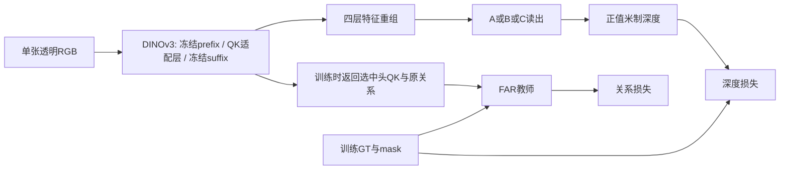

# 04｜模型设计：三种读出、FAR 教师与单头 Q/K LoRA

状态：待实现技术规格。依据修订计划 M3–M13，以及理论独立版 §2–§11。数据/关系有效域以较新的修订计划为准。

本章给出文件、接口、张量、运算顺序和应验证的不变量。代码块是实现参考，尚未组成可运行训练工程。官方 attention 的版本与 API 细节见 [03](03_DINOv3_H16plus_下载配置与特征接口.md)。

## 1. 三种运行路径必须分清



- **正常学生预测**：attention 始终由 RGB 产生的 Q/K 决定；GT 只进入外部 loss。
- **oracle 特权诊断**：仅在独立工具中以 P 替换指定 attention，运行 `P @ V0`，保持下游模型固定。
- **部署**：Q/K 增量合并进独立权重副本，去掉教师、trace 与 oracle；输入只有 RGB。

不要在学生训练的 forward 中执行 `P @ V`，那会变成靠 GT 产生预测。不要只改变画出来的 attention 热图，oracle 必须改变真实 attention 输出并完整重算 suffix 和读出。

## 2. 文件职责与张量契约

| 文件 | 核心对象/函数 | 输入 → 输出 |
|---|---|---|
| `models/backbone/dinov3.py` | `DinoV3Features` | RGB → 四层 norm 后 patch 特征；训练可返回 trace |
| `models/backbone/selected_qk_lora.py` | `SelectedQKLoRA` | LN后tokens → 指定头 Q/K 增量 |
| `models/backbone/attention_adapter.py` | `FARAttentionAdapter` | 保持官方完整attention语义；可记录所选头或执行oracle |
| `models/reassembly.py` | `ReassemblePyramid` | 四个同分辨率特征 → 四尺度 P1..P4 |
| `models/blocks.py` | `ConvGNAct`,`RB`,`CC`,`Down` | 同宽残差/拼接/下采样 |
| `models/decoders/dpt.py` | `DPTFuse` | P1..P4 → /4特征 |
| `models/decoders/unet.py` | `UNetDecoder` | P1..P4 → /4特征 |
| `models/decoders/dual_unet_dpt.py` | `DualUNetDPTDecoder` | P1..P4 → /4深度特征、语义特征 |
| `models/heads.py` | `DepthTail`,`PositiveDepth`,`SegTail` | /4特征 → 全分辨率输出 |
| `models/predictor.py` | `DepthPredictor` | RGB → `Prediction` |
| `far/teacher.py` | `build_teacher` | 原logits、可靠patch、GT代表深度 → detach的P |
| `far/relation_loss.py` | `relation_kl` | P、学生所选query完整key logits → 每图损失 |
| `oracle/runner.py` | `OracleRunner` | 固定模型、候选和允许标签 → 配对误差 |

统一记号：batch 用 `B`，通道 `C=1280`，head 数 `Hh=20`，每头 `d=64`；`N=773=5+24×32`。解码器 B 和 batch B 在代码中分别叫 `architecture`、`batch_size`，避免命名混淆。

```python
from dataclasses import dataclass
from typing import Optional
import torch

@dataclass
class AttentionTrace:
    # 所选k个head；完整序列已经经过官方RoPE，再由loss采样query。
    q_student: torch.Tensor        # [B,k,N,d], 有梯度
    k_student: torch.Tensor        # [B,k,N,d], 有梯度
    q_base: torch.Tensor           # [B,k,N,d], detach
    k_base: torch.Tensor           # [B,k,N,d], detach
    # 正常学生loss不需要V；oracle专用上下文才保留V。
    selected_block: int
    selected_heads: tuple[int, ...]
    prefix_tokens: int = 5

@dataclass
class Prediction:
    depth_m: torch.Tensor          # [B,1,384,512], float32正值
    seg_logits: Optional[torch.Tensor] = None
    trace: Optional[AttentionTrace] = None
```

训练内部 `forward(rgb, *, return_aux=False)` 只接受 RGB 和运行模式；不能接受标签、相机矩阵或来源 ID。部署另包一层 `forward(rgb) -> depth_m`，返回类型固定。GT patch/query 索引由损失端使用，不进入网络。

## 3. DINO 特征与梯度边界

### 3.1 层号与空间布局

H/16+ 层号全部是 **0-based** `[7,15,23,31]`，表示这些 block **执行后** 的 tokens。对每层应用同一冻结 backbone norm，再剥离前 5 个 prefix tokens，按行优先恢复空间网格。

```text
RGB                        [B,3,384,512]
patch grid                 [B,768,1280]
完整tokens                 [B,773,1280]
四层原特征 F1..F4          各 [B,1280,24,32]
P1                         [B,128,96,128]
P2                         [B,128,48,64]
P3                         [B,128,24,32]
P4                         [B,128,12,16]
```

特征不是天然多尺度。重组是可训练读出的一部分，计入参数量、optimizer 与 checkpoint。B/16 对照使用 `[2,5,8,11]`，从实际模型读取宽度和头数，不能把 H 的 1280/20/32 硬编码到通用基类。

### 3.2 冻结与 autograd

选择 block `l*` 后：

1. patch embedding 至 `l*-1`：参数冻结，可 `torch.no_grad()`。
2. 选中 block：原参数冻结，LoRA 有梯度。
3. `l*+1` 至最后：参数冻结，但**保留对输入的梯度**。
4. 所有 reassembly、decoder、tail：有梯度。
5. 早于 `l*` 的读出特征可 detach；晚于或等于 `l*` 的读出不能 detach。

不要将完整 backbone 包在 `no_grad` 或 `inference_mode` 中。prefix 推荐 `no_grad` 产生普通张量；`inference_mode` 张量直接进入需要保存输入的可训练层可能触发 autograd 限制。

整个 DINO 与 RoPE 保持 `eval()`，防止随机坐标变换和 stochastic depth 改变教师基准；decoder 可以 train。总模型调用 `train()` 后必须重新 `backbone.eval()`，或者覆盖 `train()` 实现该约定。`eval()` 不会关闭 LoRA 梯度。

若为 suffix 加 activation checkpoint，使用与锁定 PyTorch 版本相符的 `use_reentrant=False` 路径，并验证同一前向/重算的 trace 不重复追加、教师不被覆盖。所有缓存限制为本次 batch；不能缓存已经受 LoRA 改变的 suffix 输出跨 optimizer 更新复用。

## 4. 四尺度重组与共享块

以下补齐源计划留给工程的细节，作为 `decoder_spec_v1` 固定：GN 8 组、GELU `approximate='none'`、卷积 padding=1、双线性插值 `align_corners=False`。带 GN 的卷积 `bias=False`；单独投影、融合和输出卷积 `bias=True`。这些是统一实现选择，不是实验结论。

### 4.1 重组

每层独立 `Conv2d(1280,128,1)`：

- s1：投影 → `interpolate(size=(96,128))` → `Conv2d(128,128,3,padding=1)`。
- s2：投影 → `interpolate(size=(48,64))` → 同宽3×3卷积。
- s3：只投影，保持 `(24,32)`。
- s4：投影 → `Conv2d(128,128,3,stride=2,padding=1)`，得到 `(12,16)`。

这里不额外插入未在规格登记的归一化或激活。所有 upsample 使用目标张量的 `shape[-2:]`，不要在每层盲目乘2导致奇数尺寸错位。主输入固定384×512，仍保留运行时断言。

### 4.2 块定义

```python
from torch import nn

def conv_gn_act(cin: int, cout: int, stride: int = 1):
    if cout % 8:
        raise ValueError("decoder_spec_v1 requires cout divisible by 8")
    return nn.Sequential(
        nn.Conv2d(cin, cout, 3, stride=stride, padding=1, bias=False),
        nn.GroupNorm(8, cout),
        nn.GELU(approximate="none"),
    )

class RB(nn.Module):
    def __init__(self, c=128):
        super().__init__()
        self.body = nn.Sequential(conv_gn_act(c, c), conv_gn_act(c, c))
    def forward(self, x):
        return x + self.body(x)

class CC(nn.Module):
    def __init__(self, c=128):
        super().__init__()
        self.body = nn.Sequential(conv_gn_act(2*c, c), conv_gn_act(c, c))
    def forward(self, x, skip):
        assert x.shape == skip.shape
        return self.body(torch.cat((x, skip), dim=1))
```

`Down` 固定为 `conv_gn_act(c,c,stride=2)`，属于原计划允许的 stride 卷积实现；A/B/C 相关对照中一致使用。不加入 RGB 直连 skip，避免改变基础信息路径。

## 5. 三个 decoder 的具体组装

### 5.1 A：DPTFuse

四个输入按从细到粗顺序保存。`RB4(P4)` 得到粗特征。随后 s=3,2,1：

```text
lateral = RB_prime[s](P[s])
coarse  = interpolate(Y[s+1], size=P[s].spatial)
Y[s]    = RB[s](lateral + coarse)
```

每尺度 RB 独立参数。A 的输出是 `DepthTail(Y1)` 经一次 PositiveDepth。A 是首先实现和实验的架构。

### 5.2 B：完整 U-Net 风格读出

```text
E1 = RB(P1)
E2 = CC2(P2, Down1(E1))
E3 = CC3(P3, Down2(E2))
E4 = CC4(P4, Down3(E3))
U4 = RB4(E4)
U3 = CCup3(E3, Up(U4 -> E3))
U2 = CCup2(E2, Up(U3 -> E2))
U1 = CCup1(E1, Up(U2 -> E1))
depth = PositiveDepth(DepthTail(U1))
```

E 与 U 都保持128通道，CC 拼接时为256通道。B 最后没有 DPT。这个 B 是 decoder 标签，不是 B/16 backbone。

### 5.3 C：共享收缩、两条扩张、残差融合、DPT

共享一套 E1..E4。分别初始化 `G4=RB_g(E4)`、`S4=RB_s(E4)`，两条独立扩张路径通过 CC 恢复 G1..G4、S1..S4。

```text
enhanced_P[s] = P[s] + Conv1x1_s(cat(G[s], S[s]))
Y1 = DPTFuse(enhanced_P)
depth = PositiveDepth(DepthTail(Y1))
seg_logits = SegTail(S1)
```

融合卷积为 `256→128`，其初始化不能让整个分支永久失去梯度。默认使用标准非零随机初始化；如果研究零初始化融合，须单独检查初始梯度并记录为实现变体。

几何支不输出额外受监督深度；语义特征直接融合，不以 GT mask 或预测硬 mask 乘深度。C-noSeg 只令分割损失权重为0，保留语义分支参与深度；C-noSemFuse 仅移除语义直接融合，仍保留共享收缩及分割训练，不能宣称消除了所有任务交互。

### 5.4 公共 tail 与正值输出

`DepthTail`：/4 → 双线性到/2 → 3×3 `128→32` → GELU → 3×3 `32→1` → 双线性到384×512。无额外 GN，末端输出实数 u。

```python
import torch.nn.functional as F

def positive_depth(raw):
    # 单位解释为米；映射只执行一次。
    return F.softplus(raw.float()) + 1e-6
```

`SegTail` 使用同样空间恢复方式和单通道 logits，不加 softplus；训练传给 BCEWithLogitsLoss，展示时才 sigmoid。

可用训练集代表深度 `z0` 初始化末端偏置 `log(expm1(z0-1e-6))`，要求 z0>1e-6，固定统计来源与数值稳定实现；不能看 Dev/Test GT 校准每张预测的尺度。保留标准随机权重，不把整个可训练链同时置零。

## 6. LoRA：仅修改选中头 Q/K 的输出

最小 k=1、r=4、eta=1。对 Q 与 K 分别建立两个无bias线性层：`Linear(1280,4,bias=False)` 和 `Linear(4,64,bias=False)`，得到 `eta * up(down(X))`。Q/K 不共享因子；同一投影内多头扩展时可共享输入因子，首轮不扩展。

```text
Q行: [h*64, (h+1)*64)
K行: [1280+h*64, 1280+(h+1)*64)
V行: [2560+h*64, 2560+(h+1)*64)  # 禁止修改
```

参数总数 `2*r*(C+k*d)=10,752`，不含decoder。PyTorch权重 `[out,in]`：`down.weight=[r,C]`、`up.weight=[kd,r]`，部署增量是 `eta * up.weight @ down.weight`。理论中的 U B 是 `[C,kd]`，不要忘记方向区别。

初始化 `down` 随机、`up` 全零，不双零。LoRA 不加 bias、不加 dropout、不修改原 QKV bias/mask。eta=1 等价于 alpha=r 的 alpha/r写法；rank变化时显式保持缩放语义。

### 6.1 attention adapter 顺序

1. 复用官方 block 的 norm1 得 X。
2. 调用原 `qkv(X)`，让原模块处理有效 key bias mask；不要裸用未屏蔽的 bias。
3. 原 QKV 给教师保留原选中头 Q/K；对学生只 scatter Q/K 增量。
4. reshape为原头序；对**完整N序列**使用官方RoPE，保留5个prefix不旋转的语义。
5. 正常前向走官方SDPA和原 dropout配置，输出仍是全部heads。
6. trace只保存所选heads的Q/K；loss在旋转后选择query，keys始终完整773。
7. 继续原output projection、LayerScale、残差、norm2、SwiGLU和第二残差。

第3步使用`student_packed = base_packed + delta_packed`或独立clone后写入；不能在与base共享storage的view上原地scatter。`detach()`不复制storage，原地修改可能污染教师A0。选中head的V必须来自未修改的base。

不要重写一个“差不多”的标准ViT block。第一版可以限制模型公开接口只收单个RGB tensor、不支持multi-crop输入，但必须保留官方block内部的list调用：`SelfAttentionBlock.forward(Tensor, rope)`内部仍转入`_forward_list([x],[rope])`。不能在内部无条件拒绝list。优先适配eval路径中接收Tensor的attention模块，并通过端到端身份测试证明真实调用生效。

### 6.2 教师固定性的范围

因为只有一个适配block，上游被冻结且eval，同一个预处理RGB在选中block入口的X固定。原投影得到A0可在本次前向重算，不需要另载第二份840M模型。不同数据增强对应不同RGB，A0应重算。

教师缓存若建立，key至少含 RGB内容hash、完整增强参数、DINO代码与权重hash、预处理版本、block/head、dtype和后端；首版建议不跨batch缓存。训练用的原Q/K绝不能被提前merge覆盖。

## 7. 关系教师的可实现算法

可靠patch由02章输出 T/B 集合、每patch中位深度 z、可靠key索引 K。patch索引p映射完整token为 `p+5`。prefix、padding、ignore、混合patch不进入T/B/K；这些tokens仍在完整attention分母中。

教师对透明query做：

`S0 → A0=softmax(S0) → m=sum(A0[K]) → q=softmax(S0[K]-c) → P[K]=(1-beta)A0[K]+beta*m*q`。

补集逐元素不变。背景query P=A0，是保留原关系的约束。代价 `c=min(log(z_i/z_j)^2/(2*sigma_z^2),cmax)`，初始sigma=.1、cmax=4。正beta=.25/.5经oracle选择，beta=0身份控制。

下面是单样本单头、已选择queries的核心参考；外围负责检查合法深度、唯一且在范围内的索引和形状。

```python
@torch.no_grad()
def teacher_rows(base_logits, key_ids, query_z, key_z,
                 transparent_query, beta, sigma_z=0.1, cmax=4.0,
                 mass_eps=1e-8):
    # base_logits [Q,N]; key_ids [K]; query_z [Q]; key_z [K]
    # 必须在外层关闭autocast，所有logits/概率计算float32。
    s0 = base_logits.float()
    if not torch.isfinite(s0).all():
        raise FloatingPointError("nonfinite original attention logits")
    a0 = s0.softmax(dim=-1)
    if key_ids.numel() == 0 or beta == 0:
        return a0
    cost = ((query_z.float().log()[:, None] - key_z.float().log()[None, :])
            .square() / (2 * sigma_z**2)).clamp_max(cmax)
    q = (s0[:, key_ids] - cost).softmax(dim=-1)
    mass = a0[:, key_ids].sum(dim=-1, keepdim=True)
    use = transparent_query & (mass[:, 0] > mass_eps)
    use = use & torch.isfinite(q).all(dim=-1)
    candidate = (1-beta)*a0[:, key_ids] + beta*mass*q
    result = a0.clone()
    result[:, key_ids] = torch.where(use[:, None], candidate, a0[:, key_ids])
    return result
```

`mass_eps=1e-8` 是新增的FP32数值默认值，实施时写入配置与fallback统计。空K、质量极低、代价异常的行回退A0；原始logits本身异常则整个样本/运行报告失败，不能造均匀attention掩盖模型错误。训练GT异常在数据QA前置排除。

不要在构造后对整行再次normalize，可能改变应保持的补集；出现超容差时定位计算精度。数学身份的浮点容差先在人工小矩阵与真实FP32建立，再冻结。

### 7.1 只采样query、保留完整keys

训练每类至多128个query，从可靠T和B分别均匀无放回抽取；不足则全取，独立随机流。每行key仍为完整N。base与student用相同query索引、head和RoPE后序列。构造教师时K仍包含全部可靠keys，不因query抽样被削减。

以单个样本b、k个选中heads为例，从声明的`[B,k,N,d]` trace得到query logits：

```python
with torch.autocast(device_type="cuda", enabled=False):
    # qids是此图T/B抽样后的完整token索引，位于设备上；沿N维选取。
    qs = trace.q_student[b].index_select(1, qids).float()  # [k,Q,d]
    ks = trace.k_student[b].float()                       # [k,N,d]
    student_logits = (qs @ ks.transpose(-2, -1)) / (64 ** 0.5)  # [k,Q,N]
```

对多维trace不能写`qs[qids]`误索引batch/head，也不能用`.T`反转所有维度。以显式FP32 logits计算loss，正常学生attention输出仍走SDPA；不要为了可视化存下32层×20头的完整attention。

### 7.2 KL与空集合

每query `sum_j P_j*(log(P_j)-log_softmax(Ss)_j)`，方向KL(P||As)。`P=0`项用0约定；可用 `torch.special.xlogy(P,P) - P*logAs`。教师detach，学生保留梯度。不在key维取mean，不再除N。

先对每图T/B各自query均值，再对非空类别等权，之后在k个heads平均。每图无关系时返回与学生图连接的零，例如 `student_logits.sum()*0.0`，保留DDP图一致；正常样本的关系损失不因本batch存在无关系图被重新放大。完整16图等权规则见05。

## 8. Oracle 实现边界

oracle模式保持所有参数不变，在选中head用P替换A0，计算 `P @ V0`，其余head正常计算。替换后的全部heads一起进入原输出投影及整个block/suffix/decoder；当前V必须取原透明RGB前向值，不替换成GT、opaque或其他图的V。

oracle使用完整可靠透明query进行干预；训练的query抽样是loss估计，不能把它误用成oracle只随机改一部分行。只需要保存所选head的矩阵，每候选的beta/head独立运行，同组RGB基准预测复用。

必须先验证：原SDPA、显式A0@V0、P=A0身份干预三条路径在FP32允许误差内等价。官方多头reshape、输出projection、RoPE前缀和有效bias任一偏差都能产生假收益。

## 9. 损失与监督边界

深度：`rho_0.1(log(pred_m / gt_m))`，按每图透明/背景有效像素分别均值再平衡。实现为手写Huber或 `F.huber_loss(...,delta=.1)`；默认beta=.1的SmoothL1与此相差比例，不能直接互换。

主实现深度有效域为 `valid_depth & mask_known & content`；保留全量 `valid_depth` 作QA，unknown类别像素暂不参与平衡深度，明确报告coverage。关系另有可靠patch要求，分割为 `mask_known & content`。三种valid不能用一个字段代替。

分割用BCEWithLogits，按已知0/1类平衡，不加Dice、法线、折射流、梯度或额外边界损失。无透明/无背景只对非空类归一；无有效深度样本在manifest验收阶段处理，不运行中静默跳过导致曝光和DDP错乱。

## 10. 合并与结构验收

在FP32独立部署副本中：

```text
Q_weight[selected_rows] += eta * Q_up.weight @ Q_down.weight
K_weight[selected_rows] += eta * K_up.weight @ K_down.weight
```

保留原有效bias屏蔽；禁止写V行；标记 `merged=true` 防重复合并。部署基础权重是合并后的版本，训练教师基础hash仍指原始权重。导出同时记原始checkpoint hash、adapter hash、model spec和训练commit。

| 检查 | 输入/操作 | 必须得到的证据 |
|---|---|---|
| 四尺度 | 合成RGB坐标网格 | 特征层号、token顺序与尺寸完整记录 |
| 三架构 | 一个固定batch | 输出形状一致、均为正值米制 |
| 梯度 | λrel=0，只深度反传 | LoRA up初始有梯度，down第二步起可更新；suffix原参数不变 |
| 参数白名单 | 保存前后hash | 只有decoder/LoRA及C分割相关参数变化 |
| 零LoRA | 同RGB、同precision | 等于未适配骨干与同decoder |
| 教师 | 人工分布、空K、极小m | 行和/非负/可靠质量/补集/退化成立 |
| 固定教师 | 两次LoRA更新 | 相同RGB的A0不变，As可以改变 |
| KL梯度 | 小logits矩阵 | dKL/dS=As-P，扣除已知平均权重 |
| oracle身份 | P=A0 | 选中head、block、最终深度都与原路径一致 |
| merge | 固定Dev RGB | QK/attention/depth误差均在预定容差 |
| RGB-only | 标签路径不可访问 | 预测成功且与原输出一致 |
| C分支 | λseg=0 | G/S均能经融合收到深度梯度 |

通过这些检查证明实现满足设计；FAR是否优于普通LoRA仍须05–06章的配对训练、独立确认与测试。不要用小张量数学正确代替真实深度收益。
